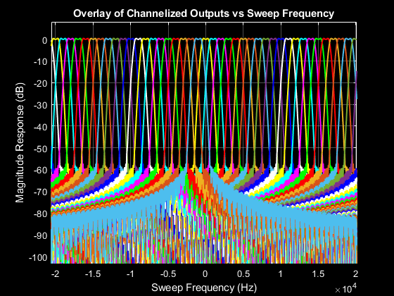
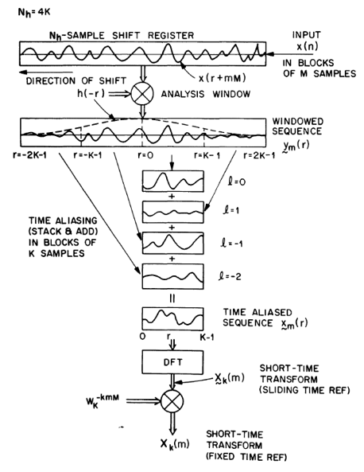

# Explore Efficient Filterbank Channelizer Architectures

This repo contains full implementations of a Weighted Overlap-Add (WOLA) and a Polyphase (PFB) analysis filterbank. Also included are demonstration "wrapper" scripts that make it easy to explore different channelizer designs using these architectures. Finally, a C++ MEX WOLA implementation is included, which is capable of running many times faster than the m-file equivalent.

The WOLA and PFB functions support both maximally and non-maximally decimated configurations, and allow control of filter bandwidth independent of channel spacing.

# Files
* wola_chanex.m - Weighted overlap-add analysis filterbank
* wola_channelizer_demo.m - Demonstration of WOLA channelizer
* pfb_chanex.m - Polypnase analysis filterbank
* pfb_channelizer_demo.m - Demonstration of PFB channelizer

The m-file functions have been tested and are compatible with MATLAB and GNU Octave. The MEX file has been built and tested on a RHEL 8 linux system.

# External dependencies

No MATLAB toolboxes or GNU Octave packages are required.

The WOLA and PFB filterbank functions have no external dependencies and run right out of the box given user supplied input data and filter coefficients.

The demonstration scripts use the author's [WSINC](https://www.mathworks.com/matlabcentral/fileexchange/181174-wsinc) package (available on MATLAB File Exchange and github) to design the prototype filter. To run the demonstrations, download WSINC and add it to your MATLAB / GNU Octave path.

The MEX file requires FFTW version 3 and a C++ compiler supporting C++17 or newer.

# Examples

### Example 1: Demonstrate an 8 channel, maximally decimated channelizer
This is the default configuration used when no arguments are supplied to the demo script. The following command uses the WOLA implementation to channelize a chirp signal and plots the the magnitude reponse of the channelized outputs. The channelizer configuration is first echoed to the console followed by filter design information provided by WSINC and finally an overlay plot of the channelized chirp signal. 

The chirp signal is a complex tone with linearly sweeping frequency over the range -Nyquist to +Nyquist. From the plot it is seen that as the chirp passes through the passband of each channel it traces an approximation of the prototype filter's magnitude response.

The ywola array returned by the demo is a 12400-by-8 matrix where each row contains 1 channelized sample and each column contains 1 channel. Column ordering is the same as MATLAB/GNU Octave's fft(). That is, the first column is DC, the last column carries the channel centered at fs-1/M. Column 5 contains the Nyquist channel.
```
>> ywola = wola_channelizer_demo();
WOLA Channelizer Demo
         Channels (M) = 8
       Decimation (D) = 8
     Sample Rate (fs) = 1 Hz
     Channel BW (cbw) = 0.1 Hz
  Transition BW (tbw) = 0.10
         Window (win) = hamming
  Stopband Atten (dB) = 60.0

Window             Ntaps          Fc       Fstop         Fs    Adb       F.1db        F1db        F3db   Psbdb
hamming              989    6.25e-02    6.88e-02   1.00e+00     60    0.00e+00    0.00e+00    0.00e+00     -80
Elapsed time is 0.393678 seconds.
>> 
```


Repeat with the PFB implementation.
```
>> ypfb = pfb_channelizer_demo();
PFB Channelizer Demo
         Channels (M) = 8
       Decimation (D) = 8
     Sample Rate (fs) = 1 Hz
     Channel BW (cbw) = 0.1 Hz
  Transition BW (tbw) = 0.10
         Window (win) = hamming
  Stopband Atten (dB) = 60.0

Window             Ntaps          Fc       Fstop         Fs    Adb       F.1db        F1db        F3db   Psbdb
hamming              989    6.25e-02    6.88e-02   1.00e+00     60    0.00e+00    0.00e+00    0.00e+00     -80
Elapsed time is 0.519995 seconds.
>>
```


### Example 2: Demonstrate a 128 channel, non-maximally decimated channelizer
There's a lot going on here compared to the previous example. Besides a much larger channel count, the decimation D=40 is now less than the number of channels M=128. Thus the sample rate of each channelized output is 128000/40=3200 Hz or 3.2x higher than a maximally decimated channelizer. 

Using different values for M and D enables achieving an arbitrary sample rate. The only constraints on M and D is that they must both be integers with M>1 and D<=M.

The channel bandwidth in this example is wider than the channel spacing (channel spacing: fsin/M = 128000/128 = 1 kHz and channel bw = 128000/96 = 1333 Hz). Note that for readability the figure is zoomed into the inner 40 channels.
```
>> [ywola,wcofs,wres] = wola_channelizer_demo(128,40,128000,128000/96,0.35,'hamming',40);
WOLA Channelizer Demo
         Channels (M) = 128
       Decimation (D) = 40
     Sample Rate (fs) = 128000 Hz
     Channel BW (cbw) = 1333.3 Hz
  Transition BW (tbw) = 0.35
         Window (win) = hamming
  Stopband Atten (dB) = 40.0

Window             Ntaps       Fc    Fstop        Fs    Adb    F.1db     F1db     F3db   Psbdb
hamming              813      667      900    128000     40      438      528      603     -74
Elapsed time is 0.253603 seconds.
>>
```


Repeat with the PFB implementation.
```
>> [ypfb,pcofs,pres] = pfb_channelizer_demo(128,40,128000,128000/96,0.35,'hamming',40);
PFB Channelizer Demo
         Channels (M) = 128
       Decimation (D) = 40
     Sample Rate (fs) = 128000 Hz
     Channel BW (cbw) = 1333.3 Hz
  Transition BW (tbw) = 0.35
         Window (win) = hamming
  Stopband Atten (dB) = 40.0

Window             Ntaps       Fc    Fstop        Fs    Adb    F.1db     F1db     F3db   Psbdb
hamming              813      667      900    128000     40      438      528      603     -74
Elapsed time is 0.547756 seconds.
>> 
```

# Brief description of the WOLA and PFB Analysis Filterbanks

The WOLA analysis filterbank is described in section 7.2 of reference 1. Figure 7.19 from that reference is reproduced below to show the signal flow. Unfortunately the Crochiere reference uses a different notation than I. They use M for decimation where I use D, and they use K for number of channels where I use M. 

The input data is shifted into the shift register, D samples at a time, forming the analysis window. The prototype filter is applied as a point by point multiplication with the contents of the shift register. The next step is a stack and add operation on blocks of M samples. The result of the stack and add is transformed via DFT into the frequency domain before a final phase correction to ensure phase continuity between blocks is applied.



The PFB analysis filterbank is described in chapter 9 of reference 2. The diagram below shows the steps involved. The flow is similar to the WOLA channelizer but with the windowing and stack and add steps replaced by a polyphase filter bank. The circles labeled DOT represent dot products of the mth polyphase filter branch coefficients with the mth set of data samples.


# References
1. R.E. Crochiere, L.R. Rabiner, "Multirate Digital Signal Processing," Prentice Hall, 1983.
2. F.J. Harris, "Multirate Signal Processing for Communications Systems," Prentice Hall, 2004.
